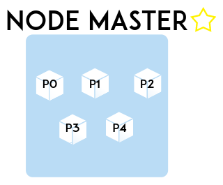
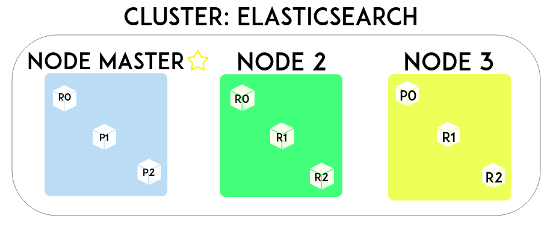

# Elastic Stack para iniciantes

   Quando comecei a estudar sobre o `Elastic Stack`, encontrei diversos conteúdos que traziam explicações muito "pesadas" e que em pouco tempo de leitura, te levavam a realizar várias pesquisas para entender o significado de cada sub-tópico, conceito ou ferramenta adjacente ao assunto principal.

   Sendo assim, decidi criar este repositório para explicar um pouco sobre o que aprendi sobre a _stack_, com uma linguagem mais informal e amigável para quem está iniciando no assunto, mas sem deixar de apresentar os conceitos essenciais. Aviso desde já que o objetivo deste repositório não é ser um guia de referência ou apresentar um conteúdo nível expert, mas sim te tornar apto a utilizar a ferramenta no seu dia-a-dia, compreendendo o funcionamento básico de cada ferramenta que compõe a stack.


   Não se preocupe se em alguns momentos aparecerem termos confusos que ainda não foram explicados, pois ao longo do treinamento eles se tornarão claros para você :)


## Elasticsearch


  O `elasticsearch` é uma ferramenta de buscas _open source_ desenvolvido em Java, assim como é uma solução NoSQL de armazenamento de dados, ou seja, não segue os padrões de bancos de dados SQL comuns (como o MySQL, por exemplo). Ele tem como base o [Apache Lucene](https://github.com/apache/lucene-solr), que é uma biblioteca Java de pesquisa _full text_ e que é também, o motor de busca open source mais avançado oferecido hoje em dia. Porém, usar todo o poder de fogo do Lucene exige um certo esforço, afinal, por ser apenas uma biblioteca, você precisa trabalhar com o Java para integrá-lo com sua aplicação (e esta tarefa pode apresentar uma certa complexidade).

  O Elasticsearch no entanto, se aproveita do Lucene na _indexação_ e pesquisa de documentos, retirando a sua complexidade através de uma API RESTful super fácil de se utilizar. Além disso, vamos citar algumas características que o tornam uma ferramenta excelente e extremamente veloz:

* Uma API RESTful para inclusão, remoção e acesso aos dados utilizando o padrão JSON.
* Totalmente livre de normalização.
* Qualquer palavra _indexada_ no elasticsearch pode ser pesquisada da mesma forma que você faz uma busca no Google.
* Altamente escalável (feito para o _Cloud Computing_).
* Permite pesquisas estruturadas e analíticas em _real-time_.
* Possui uma inteligência interna que entrega o melhor resultado em relação a busca feita (análise de relevância).
* Extremamente rápido. Explicaremos o por quê `:)`

## Onde usar ?

  Tudo bem, ficou claro o que o Elasticsearch é. Mas aonde e como eu posso utilizá-lo ?

__Exemplo 1:__
Bem, um dos cenários mais comuns é utiliza-lo como um agregador de logs em conjunto com o Logstash e o Kibana, que são outras ferramentas da organização _Elastic_, formando o que chamamos atualmente de `Elastic Stack` (o acrônimo `ELK` não é mais utilizado). Através desta _stack_, possuímos uma ferramenta de busca e armazenamento de documentos (Elasticsearch), uma ferramenta de agregação, filtro e envio de dados (Logstash) e por fim, uma _web view_ para pesquisa e análise gráfica dos dados já armazenados (o nosso querido Kibana).

A partir disso, você sysadmin ou desenvolvedor, pode centralizar qualquer tipo de log gerado por _"qualquer coisa que gere log"_ e então, realizar análises, pesquisas de baseline ou montar dashboards de métricas pré-definidas.

Vamos imaginar a seguinte situação: você é responsável por um sistema computacional que possui 30 servidores e em cada um, 30 _microserviços_ diferentes. De repente, algum problema crítico acontece com este sistema e você precisa descobrir o que ocorreu. Por instinto, você irá ler as logs do sistema para tentar entender o que houve, certo ? Mas... será que você pode se dar ao luxo de logar em 30 servidores e procurar a log entre 30 microserviços diferentes em um momento de crise ?

Agora, se você possuir um ponto central que lhe permita realizar uma busca através de uma sintaxe super simples ou ainda que lhe permita gerar um gráfico que contabilize a quantidade de vezes que esse erro ocorre, será muito mais fácil de identificar o problema não concorda ? Prazer, `Elastic Stack`.

__Exemplo 2:__
Outra forma de se usar o Elasticsearch é como uma solução NoSQL. Como ele escala horizontalmente com extrema facilidade (escalar horizontalmente nada mais é do que adicionar novos servidores com instâncias de Elasticsearch atuando como se fosse uma, representando o que chamamos de _cluster_), é comum ver empresas utilizando-o como um _Big Data_, já que a quantidade de dados e servidores gerenciados, não é um problema para o Elasticsearch (_deal with it_). Neste caso de uso, o Logstash pode não existir na composição da stack, mas o Kibana pode ainda ser utilizado para visualizar os dados graficamente e gerar dashboards personalizados.

Enfim, chega de conversa. Vamos ver como isso funciona na prática !

## Instalação

Instalar o Elasticsearch é a segunda coisa mais fácil do mundo de se fazer. A primeira é desinstalar. Vamos ver como se faz ?

Podemos fazer o download pelo repositório da Elastic atravéz de um gerenciador de pacotes como `dnf` ou `apt-get`, ou podemos realizar o download do .zip no site da [Elastic]( https://www.elastic.co/downloads/elasticsearch ). Para conseguir realizar todo o treinamento, não se esqueça de garantir pelo menos 3GB de memória para sua máquina, VM ou container, ok ?


Para este exemplo, vamos utilizar a segunda opção:

__1°__ - Realizar o download do .zip mais atual do Elasticsearch.

__2°__ - Realizar o unzip do pacote baixado em algum diretório do seu servidor.

__3°__ - Pronto, Elasticsearch instalado. Fácil né ? Agora vamos ver se tudo ocorreu bem ?

__OBS:__ Acredito que haja retrocompatibilidade na maioria das operações que iremos realizar, mas para este guia estamos utilizando especificamente a versão 5.6.5 de todas as ferramentas da stack.

Dentro do diretório gerado após a descompactação, vamos executar:
```
nohup bin/elasticsearch &
```

Dessa forma, o processo do Elasticsearch se iniciará em background. Após alguns segundos (ou se você acompanhou o start pelo nohup.out), execute o seguinte comando:

```
curl -XGET http://localhost:9200/
```
Se você recebeu um retorno parecido com esse, quer dizer que tudo está funcionando como deveria:
```
{
  "name" : "XJWzjDi",                           # Nome da instância (iremos alterar isto mais tarde).
  "cluster_name" : "elasticsearch",             # Nome do cluster que a nossa instância pertence.
  "cluster_uuid" : "ZH9GequzQX-oobJVGPlbjg",    # Identificador universal do seu cluster (como um CPF do seu cluster).
  "version" : {                                 # Dentro desta "tag" temos todas as informações sobre versão de produto.
    "number" : "5.6.5",                         # Versão do Elasticsearch.
    "build_hash" : "57e20f3",                   # "ID" da geração deste pacote de Elasticsearch.
    "build_date" : "2017-09-23T13:16:45.703Z",  # Data de geração deste pacote.
    "build_snapshot" : false,                   # Irrelevante (é irrelevante sim, para de reclamar).
    "lucene_version" : "6.6.1"                  # Versão do Lucene utilizada.
  },
  "tagline" : "You Know, for Search"            # Uma resposta amigável do Elasticsearch.
}

```
Legal, mas o que realmente aconteceu aqui ? Lembra que o Elasticsearch possui uma API RESTful ? Lembra o que é API RESTful ? Lembra o que é REST ? Não ? Que vergonha...

Falando da forma mais simples possível, uma API RESTful é uma API que faz/aceita chamadas REST e REST, representa um conjunto de operações padronizadas que permitem a troca de informação entre sistemas através de simples métodos HTTP.

No exemplo acima, fizemos uma chamada __REST__ solicitando uma resposta para o nosso Elasticsearch através do método HTTP __GET__ e como retorno à nossa requisição, recebemos uma resposta no formato __JSON__ com algumas informações básicas sobre a nossa instância de Elasticsearch.

Trabalhando com o Elasticsearch, sempre usaremos o formato JSON, tanto para enviar requisições, quanto na resposta (como no exemplo acima).

Sobre o JSON, imagine que você precise fazer duas aplicações totalmente distintas se comunicarem entre si ? Como fazer essa troca de informação ? O JSON por ser um formato padrão aceito pela maioria das linguagens de programação, pode ser utilizado para garantir que as duas aplicações possam "entender" o que a outra está querendo dizer de forma mais simples e legível se comparada com outros padrões como o _XML_ por exemplo. Vamos ver como este padrão funciona ?

```
{ # Abertura de sequência.
                            # O padrão é "campo", ":" e "valor".
                            # Caso hajam vários campos, colocar uma "," no final.
  "nome": "John Will",      # Strings precisam estar entre aspas.
  "idade": 19,              # Inteiros são apresentados sem aspas.
  "deficiente": True,       # Booleanos são bem-vindos.
  "interesses": [ "musica", # Arrays sao representados entre [].
                "esportes"]
} # Fechamento da sequência. Fim do documento JSON.
```

Agora que sabemos como criar um _documento_ JSON, vamos entender a sintaxe utilizada para as chamadas REST:

```
curl -X<VERB> '<PROTOCOLO>://<HOST>:<PORTA>/<PATH>?<QUERY_STRING>' -d '<BODY>'
```

O __curl__ é uma ferramenta para transferência de dados através de uma URL. Usaremos ela para realizarmos as nossas requisições. Segue a explicação para os demais campos:

__VERB__ -> GET, POST, PUT, DELETE.

__PROTOCOLO__ -> http, https...

__HOST__ -> Servidor do Elasticsearch.

__PORTA__ -> Porta do Elasticsearch (9200 é a porta padrão).

__PATH__ -> Aonde você quer pesquisar, atualizar ou deletar (qual o _index_, _type_ e _document id_ ?).

__QUERY_STRING__ -> A pesquisa propriamente dita.

__BODY__ -> O documento JSON que você quer enviar ou utilizar como parâmetro de pesquisa.

## Index, Type, Document ?

Agora que fizemos a instalação e garantimos que o nosso Elasticsearch está operacional, vamos entender na prática o que é um _index_, _type_ e um _document_. Para isto, vamos começar a colocar alguns dados no nosso Elasticsearch ! Execute o comando abaixo:

```
curl -XPUT http://localhost:9200/mycompany/funcionarios/1 -d '
{
  "nome": "João Silva",
  "idade": 19,
  "endereco": "Avenida da Magia",
  "hobbies": ["Tocar guitarra", "Acampar com a familia"],
  "interesses": "musica"
}'
```

Provavelmente você recebeu uma resposta parecida com esta:
```
{"_index":"mycompany","_type":"funcionarios","_id":"1","_version":1,"result":"created","_shards":{"total":2,"__successful__":1,"failed":0},"created":true}
```
Isto significa que o nosso documento JSON foi _indexado_ com sucesso. O verbo PUT utilizado, basicamente diz para o Elasticsearch, "guarde este documento __NESTA__ url" (o POST se assemelha em funcionalidade, porém dizendo a frase: "guarde o documento __ABAIXO__ desta url". Entenderemos melhor a diferença posteriormente).

Para facilitar o entedimento do conceito de _index_, _type_ e _document_, vamos fazer uma analogia com um banco de dados SQL padrão:

| MySQL        | Banco de Dados           | Tabela  | Chave Primária | Linha | Coluna
| ------------- |:-------------:| -----:|-----:|-----:|-----:|
| __Elasticsearch__        | __Index__           | __Type__  | __Id__ | __Document__ | __Field__
| ------------- | mycompany| funcionarios|1|Documento JSON|nome, idade...|


__Importante:__ Os termos "indexar" e "index" possuem significados diferentes no universo do Elasticsearch e também, se diferenciam do conceito de índices utilizados em Banco de Dados. Indexar no Elasticsearch é o mesmo que adicionar um documento JSON (como realizar um INSERT), e index é uma forma de separar logicamente dados de diferentes propósitos.

Ok, temos o nosso primeiro funcionário João Silva __indexado__ no nosso __index__ mycompany ! Vamos fazer a nossa primeira consulta:

```
curl -XGET http://localhost:9200/mycompany/funcionarios/_search?pretty
```

Neste comando, chamamos a API ___search___, que é a API padrão de buscas do Elasticsearch (o parâmetro __?pretty__ é opcional e só serve para formatar a saída em JSON). Como não passamos nenhum parâmetro, a API sempre nos retorna os 10 primeiros resultados, que neste caso nos trouxe apenas o João (we're hiring). Sinta-se livre para criar e consultar mais funcionários para exercitar a sintáxe :) .

## Tipos e Formas de Pesquisa

No Elasticsearch existem três _tipos_ de pesquisa (full-text, estruturada e analítica) e duas _formas_ básicas de se pesquisar (query-string e query DSL).

Para este exemplo, utilize o script [tweets.sh](https://github.com/alefeans/elastic-stack/tree/master/scripts/tweets.sh) para criar o índice twitter que irá conter diversos tweets de usuários diferentes. Caso queira visualizar os índices existentes no seu Elasticsearch, utilize a API **_cat**:

```
curl -XGET http://localhost:9200/_cat/indices?v
```
Não se preocupe com todas as informações retornadas (nem se estiver com seus índices com o "health" em "yellow"), tome por nota apenas a informação dos índices que você possui (mycompany e twitter).

Agora que geramos a massa de dados, vamos as queries ! Primeiro, vamos ver como a query-string funciona. Vamos pesquisar todos os tweets do usuário "Phill":

```
curl -XGET http://localhost:9200/twitter/tweet/_search?q=name:Phill
```

Apesar de parecer bastante simples de se utilizar, esse formato é o menos utilizado. A medida que colocamos mais parâmetros e condições, a busca começa a aparecer mais complicada do que realmente é. Por exemplo, vamos pesquisar pelo nome "Tom" no campo "name" __e__ "lina" no campo "tweet":

```
curl -XGET http://localhost:9200/twitter/tweet/_search?q=%2Bname%3Atom+%2Btweet%3Alina
```

Perceba que mesmo sendo uma pesquisa relativamente simples, a string de pesquisa é menos legível e mais "encriptada".

Agora, vamos realizar a primeira pesquisa feita no index twitter anteriormente, utilizando agora, a __query DSL__:

```
curl -XGET http://localhost:9200/twitter/tweet/_search?pretty -d '
{
  "query": {
    "match": { "name": "Phill"}
  }
}'
```

Neste formato, passamos um documento JSON como parâmetro de pesquisa. Antes de mais nada, vamos entender o que nos é retornado quando realizamos uma pesquisa. Utilizando o exemplo de retorno da query acima, temos o resultado abaixo:

```
{
  "took" : 8,                 		# Tempo em milissegundos que a query demorou para  retornar.
  "timed_out" : false,        		# Houve Time Out na busca (True or False) ?
  "_shards" : {               		# Falaremos sobre shards mais tarde...
    "total" : 5,
    "successful" : 5,
    "failed" : 0
  },
  "hits" : {                
    "total" : 1,                	# Quantidade de documentos que foram encontrados.
    "max_score" : 0.25811607,   	# Falaremos sobre score mais tarde também...
    "hits" : [                  	# Dentro deste array, possuímos todos os resultados encontrados.
      {
        "_index" : "twitter",   	# Qual o index do documento.
        "_type" : "tweet",      	# Qual o type do documento.
        "_id" : "14",           	# Qual o id do documento.
        "_score" : 0.25811607,  	# Ó o score ai denovo...
        "_source" : {           	# Todos os dados do documento encontrado.
          "date" : "2018-09-23",
          "name" : "Phill Matt",
          "tweet" : "Just one is sufficient.",
          "user_id" : 3
        }
      }
    ]
  }
}
```
Inicialmente pode parecer estranho ou até um pouco frustrante ter que decifrar um documento JSON. Você tem que parar, analisar, entender o que está dentro de uma tag ou de outra... mas a medida que vamos praticando e brincando mais com o Elasticsearch, esta tarefa vai se tornando menos dolorosa ("_if it hurts, do it more often_", Martin Fowler). E relaxa, daqui a pouco estaremos usando o Kibana para nos ajudar nesta tarefa :)

Agora vamos aos três tipos básicos de pesquisa...

## Full-Text

Na pesquisa full text você simplesmente pesquisa o que você quer, sem passar nenhuma regra, agregação ou algo do tipo. Quando apresentarmos o Kibana, este tipo de pesquisa vai se apresentar de forma mais simples ainda, como uma pesquisa no Google. Vamos pesquisar as palavras "easy to use" no campo "tweet" do nosso index:

```
curl -XGET http://localhost:9200/twitter/tweet/_search?pretty -d '
{
  "query": {
    "match": {
        "tweet": "easy to use"
    }
  }
}'
```

Se você não fez nenhuma alteração no script [tweets.sh](https://github.com/alefeans/elastic-stack/tree/master/scripts/tweets.sh), você deve estar visualizando 3 tweets agora, como estes aqui:

```
{
  "took" : 8,
  "timed_out" : false,
  "_shards" : {
    "total" : 5,
    "successful" : 5,
    "skipped" : 0,
    "failed" : 0
  },
  "hits" : {
    "total" : 3,
    "max_score" : 1.9187583,
    "hits" : [
      {
        "_index" : "twitter",
        "_type" : "tweet",
        "_id" : "6",
        "_score" : 1.9187583,
        "_source" : {
          "date" : "2018-09-16",
          "name" : "Tom Michael",
          "tweet" : "The Elasticsearch API is really easy to use",
          "user_id" : 1
        }
      },
      {
        "_index" : "twitter",
        "_type" : "tweet",
        "_id" : "11",
        "_score" : 0.84843254,
        "_source" : {
          "date" : "2018-09-21",
          "name" : "Lina Jones",
          "tweet" : "Elasticsearch is built for the cloud, easy to scale",
          "user_id" : 2
        }
      },
      {
        "_index" : "twitter",
        "_type" : "tweet",
        "_id" : "3",
        "_score" : 0.17669111,
        "_source" : {
          "date" : "2018-09-13",
          "name" : "Lina Jones",
          "tweet" : "Elasticsearch means full text search has never been so easy",
          "user_id" : 2
        }
      }
    ]
  }
}
```

Talvez você não tenha reparado, mas você acabou de fazer uma pesquisa full text. Mas calma ai... porque eu tenho três respostas para a pequisa "easy to use" se em apenas um dos tweets eu realmente tenho as palavras "easy to use" ?

Bem, é ai que a graça (ou desgraça) do full text entra em ação. Repare que os três tweets retornados possuem a palavra "easy". Como a sua busca não possui nenhum filtro ou parametrização adicional, qualquer uma das trẽs palavras que compõe a sua busca (easy to use), serão pesquisadas no index informado . Porém no primeiro resultado (tweet do Tom Michael), vemos que o campo **"_score"** possui o número **"1.9187583"** como valor, correto ? Compare este número com o "_score" dos outros resultados. O que isso significa afinal ?

O Elasticsearch verifica a relevância de um documento pela proximidade da busca realizada. Como o primeiro resultado é o que mais se aproxima da busca feita, por possuir as três palavras pesquisadas, este documento recebe um número de _score mais alto do que os demais. É assim que o Elasticsearch mede a relevância de uma pesquisa feita com o resultado encontrado.

Este é o tipo de pesquisa mais simples de se fazer, porém é também o mais suscetível a falhas por acabar retornando resultados que podem não ser relevantes (e por conta do campo **"_all"** que será explicado em breve). Agora, se quisermos pesquisar a sequência exata "easy to use", podemos utilizar o recurso "match_phrase" em nossa busca:

```
curl -XGET http://localhost:9200/twitter/tweet/_search?pretty -d '
{
  "query": {
    "match_phrase": {
        "tweet": "easy to use"
    }
  }
}'
```
Repare que agora só obtivemos um retorno, correto ? Neste caso, a _frase_ é pesquisada como uma sequência única que deve ser respeitada.

Veremos em breve que geralmente realizamos pesquisas utilizando filtros e agregações para refinarmos nossas buscas. Isto melhora os resultados encontrados e geram retornos mais rápidos, já que o Elasticsearch terá que buscar a informação em um local mais específico, ao invés de ter que varrer um index inteiro para encontrar o que foi pedido. Também veremos que ao utilizar o Kibana, podemos realizar buscas sem ao menos digitar um campo específico (como o "tweet": no exemplo acima). No primeiro caso fica fácil de entender como o Elasticsearch interpreta a busca. "Aonde tiver o valor "x" no campo "y", retorne o resultado para o usuário". Mas e no segundo caso, onde você simplesmente fala "bla" pro Elasticsearch e espera que ele te mostre aonde tem o valor "bla" ? Mais tecnicamente falando, como o Elasticsearch entende o full-text quando não passamos nenhum campo como parâmetro ?

Ao indexarmos um documento, todos os valores dos campos do documento são indexados em uma única string em um campo default do Elasticsearch de nome "_all". Por exemplo, se eu estiver indexando o documento abaixo:

```
{
  "nome": "Maria",
  "idade": 28,
  "endereco": "Rua Encantada",
  "rg": 123456789,
  "hobbies": ["Cantar", "Jogar xadrez"]
}
```

O campo "_all" deste documento ficaria assim:

```
{
  "_all": "Maria 28 Rua Encantada 123456789 Cantar Jogar xadrez
}
```

Sendo assim, ao realizarmos uma busca full-text sem passarmos nenhum campo como parâmetro, o Elasticsearch realiza a pesquisa em todos os campos "_all" do index escolhido, o que é muito mais rápido do que ter que avaliar campo a campo de cada documento. Porém, pode acontecer de um campo diferente do que você quer buscar possuir um valor igual ao que você procura. Ficou estranho né ? Veja o exemplo abaixo:

```
{
  "nome": "Carlos",
  "idade": 21,
  "endereco": "Rua Freitas",
  "rg": 231496289,
  "hobbies": "Jogar futebol"
},
{
  "nome": "José",
  "idade": 38,
  "endereco": "Rua Carlos",
  "rg": 987654321,
  "hobbies": "Assistir Netflix"
}

```

Ao inserir estes dois documentos, o Elasticsearch geraria para cada um, as seguintes strings em seus respectivos *_all*:

```
{
  "_all": "Carlos 21 Rua Freitas 231496289 Jogar futebol
},
{
  "_all": "José 38 Rua Carlos 987654321 Assistir Netflix
}
```

Se eu quiser saber quantas pessoas de nome "Carlos" eu tenho no meu index e fizer uma pesquisa full-text para encontrar "Carlos", quantos retornos eu terei ? E se eu pesquisar por "Freitas", quantos retornos eu terei ?

Se o meu index só possuir estes dois documentos apenas, o retorno da nossa pesquisa seria: **dois** Carlos e **um** Freitas, mesmo eu só possuindo **um** Carlos e **nenhum** Freitas.

Estamos entendidos com o full-text ?

## Estruturada

Uma pesquisa estruturada diz respeito à pesquisas que possuem algum tipo de parametrização/regra envolvida. Para este exemplo, vamos usar o script [funcs.sh](https://github.com/alefeans/elastic-stack/tree/master/scripts/funcs.sh) para gerar os dados no nosso esquecido índice "mycompany".

Após executar o script, execute a pesquisa estruturada abaixo. Tente interpretá-la juntamente com o seu resultado antes de ler a explicação, ok ?

```
curl -XGET http://localhost:9200/mycompany/_search\?pretty -d '
{
  "query": {
    "bool": {
      "must": {
        "match": {
          "nome":   "Silva"       
           }
        },     
      "filter":  {
       "range": {
         "idade": {"gt": 30}
        }    
      }
    }
  }
}
'
```

E ai, conseguiu ? Se a resposta for não, fique tranquilo, algumas coisas novas apareceram por aqui. Vamos entendê-las melhor:

__1°__ - Iniciamos o parâmetro "query".
__2°__ - O parâmetro de busca "bool" inicia uma combinação de resultados entre queries, indicando um ou mais filtros à serem respeitados.
__3°__ - O **"must"** é um parâmetro de "bool" que significa que o valor __DEVE__ ser encontrado em todos os resultados. Isto contribui para um **_score** mais preciso (lembra dele ?).
__4°__ - Dentro da cláusula "must" temos o parâmetro "match" já usado para pesquisas mais simples. Este tem a simples tarefa de relacionar um campo com um valor.
__5°__ - Perceba que há uma "**,**" antes do parâmetro **"filter"**. Em JSON, a vírgula faz a separação de múltiplos campos lembra ? Estamos passando duas cláusulas para o parâmetro "bool" avaliar: **"must"** e **"filter"**, sendo assim, precisamos separá-los por vírgula.
__6°__ - Dentro de "filter", passamos um "range" para o nosso campo "idade", que neste caso, deve ser maior que 30 (**gt** = greater than).

Após compreendermos cada passo, a tradução final da query seria esta:
_"Elasticsearch, quais são os funcionários com mais de 30 anos que tem Silva no nome ?"_

A medida que as pesquisas se tornam maiores e mais específicas, mais campos e parâmetros são encadeados para satisfazer as condições da busca. Existem diversos argumentos disponíveis para a refinação de queries que são facilmente encontrados na documentação da [Elastic](https://www.elastic.co/guide/index.html). Alguns serão abordados mais a frente, após aprendermos o básico sobre os tipos de busca :) .

## Analítica

Finalizando os tipos de pesquisa existentes, temos a pesquisa analítica. O Elasticsearch possui uma funcionalidade chamada _aggregations_, que permite a geração de análises sofisticadas sobre os seus dados (se parece com o GROUP BY do SQL, só que bem mais poderoso). Vamos pesquisar quais são os interesses mais populares entre nossos funcionários. Mas antes, precisamos habilitar uma estrutura chamada __fielddata__ em nosso Elasticsearch, que vem desabilitada por padrão:

```
curl -XPUT http://localhost:9200/mycompany/_mapping/funcionarios -d '
{
  "properties": {
    "interesses": {
      "type":     "text",
      "fielddata": true
    }
  }
}'
```

Esta feature vem desabilitada por conta do consumo de memória que uma pesquisa de texto muito grande pode gerar (já que há outras formas de estruturar os seus dados à tornarem agregações mais simples de serem executadas). Como estamos apenas brincando com alguns dados fictícios, não há necessidade de se preocupar com isto agora ou se aprofundar neste assunto. Masssss, caso queira entender um pouco mais, acesse este link da [documentação da Elastic](https://www.elastic.co/guide/en/elasticsearch/reference/current/fielddata.html).

Agora que habilitamos o fielddata, vamos fazer nossa pesquisa !

```
curl -XGET http://localhost:9200/mycompany/funcionarios/_search?pretty -d '
{
    "query" : {
        "match_all" : {}
    },
    "aggs" : {
        "maiores_interesses" : {
            "terms" : {
                "field" : "interesses"
            }
        }
    }
}'
```

O parâmetro **"aggs"** é utilizado para descrevermos todas as nossas agregações que serão realizadas. O **"maiores_interesses"** foi um nome fictício (como um _alias_), dado para o nosso conjunto de resultados e poderia ter sido qualquer outro (ex: total_de_interesses, interesses_gerais, etc). Após nomear o nosso conjunto de resultados, usamos o parâmetro **"terms"**, para descrevermos por qual(is) **"field(s)"** queremos agregar os resultados.

Para facilitar a visualização, vamos observar apenas o final do resultado obtido:

```
  "aggregations" : {
    "maiores_interesses" : {
      "doc_count_error_upper_bound" : 0,
      "sum_other_doc_count" : 0,
      "buckets" : [
        {
          "key" : "esportes",
          "doc_count" : 2
        },
        {
          "key" : "musica",
          "doc_count" : 2
        },
        {
          "key" : "filmes",
          "doc_count" : 1
        },
        {
          "key" : "games",
          "doc_count" : 1
        },
        {
          "key" : "musculacao",
          "doc_count" : 1
        }
      ]
    }
  }
}

```

Dentro de **"maiores_interesses"**, temos a separação dos resultados por **"buckets"**, que nos revelam a quantidade de documentos que foram encontrados fazendo menção a cada resultado. Algo que mais "embelezado" ficaria assim:

| Interesses        | Documentos Encontrados
| ------------- |:-------------:|
| Esportes | 2|
| Musica |2|
| Filmes | 1|
| Games | 1|
| Musculação | 1|

Ou seja, com uma simples pesquisa conseguimos encontrar fatores em comum sobre nossos funcionários e agora sabemos quais sãos os maiores interesses dentro de nossa empresa. Possuímos poucos dados para brincar até o momento, mas imagine em uma empresa com 5.000 funcionários. Será que conseguimos tirar algum proveito disso ? Será que conseguimos correlacionar nossos dados para encontrar benefícios que possam ser mais úteis para nossos colaboradores ? Pense só, temos poucos dados, mas já sabemos que a maioria dos funcionários gostam de música e esportes.

Apesar de abordarmos tarefas simples com os tipos de pesquisa do Elasticsearch, a quantidade de operações, agregações e filtros possíveis são quase infinitos ! Tudo vai depender da quantidade de dados que você possui e a quantidade de regras que você quer especificar em suas buscas.


## Tudo muito fácil. O que mais eu posso fazer ?

Agora que entendemos sobre as formas e os tipos de pesquisa de forma básica, vamos aprender mais alguns comandos e funcionalidades utilizando as APIs do Elasticsearch, antes de partirmos para o Logstash e o Kibana.

##### Shutdown

Depois de tanto tempo no ar, vamos dar um descanço pro cara né ? Para finalizar o seu Elasticsearch, você pode OU pará-lo via __service management__  utilizando, por exemplo, o comando "_systemctl stop elasticsearch_" OU enviando um _SIGTERM_ para o seu processo. Como fizemoas a instalação diretamente do .zip, usaremos a segunda forma:

```
$ jps | grep Elasticsearch
22223
$ kill 22223
```
Ou se você for mais _oldschool_:
```
$ ps -ef | grep -i elasticsearch | grep -v grep | awk '{print $2}'
22223
$ kill 22223
```

##### Contagem de Documentos

Eu odiava ver tutoriais que me ensinavam a baixar a aplicação, para logo em seguida pedir para subir e fazer alguma outra coisa. Chegou a hora de dar o troco ! Vamos subir novamente a nossa instância de Elasticsearch e vamos contar quantos documentos existem em nossos índices:

```
nohup ./elasticsearch &
```
Vamos utilizar a API **_count** para contar quantos documentos existem no index "mycompany":

```
curl -XGET http://localhost:9200/mycompany/_count?pretty
```

Caso você queira contar a quantidade de documentos totais em seu Elasticsearch, é só retirar o index mycompany da pesquisa:

```
curl -XGET http://localhost:9200/_count?pretty
```

##### Entendendo melhor os contextos

Até agora, aprendemos a inserir dados em nosso Elasticsearch informando o __id__ que o documento irá possuir. Um exemplo disso foi a nossa primeira inserção e o conteúdo do script [funcs.sh](https://github.com/alefeans/elastic-stack/tree/master/scripts/funcs.sh), onde passamos o caminho completo que o documento será inserido:

```
curl -XPUT http://localhost:9200/mycompany/funcionarios/1
```

Neste tipo de inserção, informamos o index, o type e o id (1 no exemplo acima). O que nos ajuda no momendo de fazer uma busca, por já sabermos o caminho completo do dado. Por ex:

```
curl -XGET http://localhost:9200/mycompany/funcionarios/1
```

A nível de teste, não há problemas neste tipo de abordagem. Mas não é comum informarmos o id no momento da inserção do dado, por 'N' motivos. Para ids, geralmente deixamos o Elasticsearch fazer a criação dinamicamente. Ou seja, você pode inserir dados no contexto que desejar sem precisar se preocupar com um número de id. Vamos criar mais um type para o nosso index "mycompany" chamado "diretores":

```
curl -XPOST http://localhost:9200/mycompany/diretores/ -d '
{
  "nome": "Roberto Roberts",
  "idade": 40,
  "endereco": "Rua da Chiqueza",
  "hobbies": ["Jogar golf", "Fazer chiquezas"],
  "interesses": ["orquestras", "coisas chiques"]
}'
```

Veja que utilizamos o verbo HTTP __POST__ ao invés de __PUT__. Como vimos muito anteriormente, o verbo __PUT__ fala para o Elasticsearch armazenar o dado em uma URL específica, ou seja, em um caminho completo. Já o __POST__ diz para o Elasticsearch armazenar o dado _ABAIXO_ de uma URL. Algo parecido com isso:
```
PUT:"Oi Elasticsearch."
Elasticsearch:"Fala..."
PUT:"Faz um favor ?"
Elasticsearch:"Fala..."
PUT:"Leva esse documento nesse endereço aqui ó... Bairro: mycompany, Rua: diretores no Numero: 1.
Elasticsearch:"Beleza."
```

```
POST:"E ai Elasticsearch, tudo bom :) ?"
Elasticsearch:"Lá vem você denovo pra me dar trabalho..."
POST:"Que nada ! Bom.. na verdade, eu gostaria que você enviasse um documento em um endereço pra mim."
Elasticsearch:"Ta... ta... me passa o endereço."
POST:"Então... é no Bairro: mycompany, na Rua: diretores e... hmmmm."
Elasticsearch:"Hmmm o que ? Qual é o número ?"
POST:"Esse é o problema.. eu não tenho o número, mas precisamos entregar isso agora :("
Elasticsearch:"Ah.. que ótimo. Vou entregar em qualquer número que eu escolher então !"
```

Tirando o incrível mau humor do Elasticsearch em realizar inserções de dados, é mais ou menos isso que acontece. Se não informarmos o id, o Elasticsearch gera automaticamente um id para o nosso documento. Vamos ver qual o id que ele escolheu para o nosso fino diretor:

```
curl -XGET http://localhost:9200/mycompany/diretores/_search?pretty
```

O id que ele escolheu para o meu documento foi "AWDg5HpIZFpbSN2whJNa" e provavelmente, uma outra sequência bizarra de caractes foi escolhida para você.

Outro ponto que talvez você não tenha reparado, é que podemos realizar consultas a nível de ids, types ou index. Por exemplo, se eu não souber em qual type o funcionário "Claudio Silva" está inserido, eu posso realizar uma pesquisa a nível de index. Por exemplo:

```
curl -XGET http://localhost:9200/mycompany/_search?pretty -d '
{
  "query": {
    "match_phrase": { "nome": "Claudio Silva"}
  }
}'
```

Mude o valor de "nome" para "Robert Roberts" e sua busca também encontrará o resultado. Isto acontece, pois os types "funcionarios" e "diretores" estão inseridos no mesmo index (mycompany).

##### Deletando

Para remover algum dado do Elasticsearch, utilizamos o verbo HTTP, __DELETE__ e passamos o caminho completo do dado, conforme o exemplo abaixo:

```
curl -XDELETE http://localhost:9200/mycompany/funcionarios/1

{"found":true,"_index":"mycompany","_type":"funcionarios","_id":"1","_version":2,"result":"deleted","_shards":{"total":2,"successful":1,"failed":0}}
```
Se pesquisarmos pelo funcionário de id "1", veremos que o mesmo não é mais encontrado:
```
curl -XGET http://localhost:9200/mycompany/funcionarios/1

{"_index":"mycompany","_type":"funcionarios","_id":"1","found":false}
```

Tenha bastante cuidado ao apagar um dado, pois caso você esqueça de passar o "type" e o "id" do documento, podemos acabar apagando um index inteiro (types estão seguros nesta situação, pois estes são removidos utilizando um método chamado "[delete_by_query](https://www.elastic.co/guide/en/elasticsearch/reference/6.1/docs-delete-by-query.html)").

Caso queira contratar o funcionário "João Silva" denovo, verifique a seção do treinamento de nome "Index, Type, Document ?" e execute a inserção novamente.

## Cluster, Shards e Replicas

Lembra que eu havia dito que o Elasticsearch foi feito para o _Cloud Computing_ ? Nesta seção explicaremos como a redundância e a alta disponibilidade são tratadas internamente pela ferramenta, através de alguns conceitos de _clusterização_ e replicação de dados. Já adianto que esta seção pode ser um pouco pesada para quem está iniciando, portanto preste __bastante__ atenção em cada ponto aqui explicado, pois eles são essenciais para compreender a ferramenta mais a fundo.

##### Node e Cluster
Um __node__ é uma instância em execução de Elasticsearch, enquanto um __cluster__ consiste em um ou mais nodes trabalhando em conjunto, como se fossem uma só instância. Instâncias em um mesmo cluster compartilham do mesmo _cluster name_ e possuem uma organização que permite que mais instâncias sejam adicionadas ou removidas ao cluster sem prejudicar o armazenamento dos dados. Afinal, em um ambiente na nuvem, é comum servidores serem adicionados ou descartados a todo momento e isso de forma alguma pode impactar a disponibilidade do serviço ou a integridade dos dados.

Em um cluster de Elasticsearch, sempre teremos uma instância declarada como node _master_, o que signficia que esta instância agora é responsável por lidar com alterações abrangentes, que modificam informações a nível de cluster (ex: criação/remoção de um index, adição de nodes ao cluster e etc). Pequenas alterações a nível de documento, não exigem a participação do node master, sendo assim, ter apenas um node master em seu cluster pode ser o suficiente. O interessante é que nós usuários podemos interagir com qualquer node do cluster de forma transparente para realizarmos as operações já realizadas (inclusão, pesquisa, remoção e etc), inclusive o node master.

No nosso caso, temos apenas uma instância de Elasticsearch em execução, o que significa que nosso cluster possui apenas um node e que, obviamente, é o node master. Vamos utilizar abaixo a API **_cluster** para verificarmos a saúde do nosso ambiente:

```
curl -XGET http://localhost:9200/_cluster/health?pretty
```

O campo status utiliza cores básicas para indicar a saúde do nosso cluster:
__Green__: Todos os shards primários e replicas estão ativos.  
__Yellow__: Todos os shards primários estão ativos, mas nem todas as réplicas estão.
__Red__: Nem todos os shards estão ativos.

Você deve estar pensando "E o que isso signficia se eu nem sei o que é um shard ?". Vamos tentar entender isto melhor agora...

##### Shards e Replicas

Quando indexamos nossos documentos no Elasticsearch (lembre-se do significado de _indexar_ explicado anteriormente), estamos adicionando nossos dados em um __shard__, que são basicamente containers que armazenam os dados que indexamos no Elasticsearch. Porém nossas aplicações não falam diretamente com o shard em si, mas sim com os índices (lembre-se das inserções que fizemos anteriormente). A realidade é que os índices, mycompany ou twitter por exemplo, são apenas _namespaces lógicos_ que apontam para um ou mais __shards__. Ou seja, quando realizamos uma inserção de um documento em um index no Elasticsearch, passamos o caminho do index que queremos utilizar, e este, irá armazenar este documento em algum shard qualquer (como se fosse um balanceador que redireciona o tráfego de rede para um grupo de servidores).

Após o direcionamento para um shard, o Apache Lucene entra em ação. Dentro de cada shard, há uma instância de Lucene em execução, utilizando o seu motor de busca e indexação para acessar/armazenar os nossos dados. Isso nos garante toda a inteligência e velocidade que esta biblioteca possui na busca de documentos.

Vamos executar um comando que utilizamos no inicio deste repositório para validarmos a quantidade de índices criados e consultarmos algumas informações sobre os nossos shards:

```
curl -XGET http://localhost:9200/_cat/indices?v
```

Provavelmente você recebeu um retorno parecido com este (formatei em tabela para melhorar a visualização):

| health| status | index | uuid | pri | rep | docs.count| docs.deleted| store.size| pri.store.size|
| ----- |--------|----- |------|----- |--------|----- |--------|----|:------:|
|yellow | open | mycompany | pUEvAXsjQIm | 5 | 1 | 3 | 0| 17.8kb | 17.8kb |
|yellow | open | twitter | LKz87NMtTlShp | 5 | 1 | 14 | 0| 29.9kb | 29.9kb |

Quando iniciamos uma instância de Elasticsearch, por default são criados 5 shards (coluna __pri__, que significa "primary"), com 1 réplica por shard (coluna __rep__, que significa "replica"). A medida que adicionamos mais instâncias em nosso cluster, os shards são replicados/migrados entre os nodes pelo próprio Elasticsearch, que fará o possível para manter o nosso cluster balanceado. Um shard _primary_ possui a função de armazenar todos os documentos do seu index. Já um shard _replica_, garante a redundância dos seus dados, servindo como uma cópia do seu shard primary e também, respondendo à requisições de leitura/busca de documentos.

Avaliando a tabela com o resultado do nosso comando, vemos que o "health" do nosso cluster está em "yellow", certo ? Isso se deve ao fato de possuirmos cinco shards primários armazenando nossos dados em um mesmo node, e a perda de um deles, seja por uma falha de hardware por exemplo, pode resultar em uma perda real de dados. Veja a imagem abaixo para entender melhor em que cenário o nosso cluster se encontra:



__Legenda__: P = Primary.

__OBS:__ Na realidade, nosso cluster possui 10 shards primários, já que possuímos 2 index diferentes (mycompany e twitter). Na imagem acima, considere que estamos visualizando apenas os shards de um único index, que pode ser qualquer um dos dois que possuímos em nosso ambiente.

Mas aonde estão as nossas réplicas ? Execute o comando utilizado para verificar a saúde do cluster novamente (.../_cluster/health?pretty) e observe o retorno do comando. Veja que há um campo chamado, __"unassigned_shards"__ com o valor 10. Isso significa que possuímos 10 shards que não estão associados a nenhum node de Elasticsearch e esses shards, são exatamente as nossas réplicas. Lembre-se, por default o Elasticsearch cria 5 shards primários e 1 réplica por shard quando criamos um index. O número de réplicas sempre estará associado ao número de shards primários, ou seja, possuímos 1 réplica para cada shard (5 * 1 = 5), e como possuímos dois index, dobramos este valor (5 * 2 = 10).

__OBS:__ Caso seja necessário, validem os resultados acima utilizando uma calculadora apropriada.

Pense na estratégia adotada pelo Elasticsearch em não associar nenhuma réplica ao nosso _single node_. Faz todo o sentido ! Não há nenhuma vantagem em armazenar as cópias dos mesmos dados em um mesmo node, pois caso venhamos a perder este node, tanto a cópia quanto a "original" seriam comprometidas. Sendo assim, o status do nosso cluster é classificado como "yellow" e permanecerá assim, até adicionarmos novos nodes em nosso cluster e termos nossas réplicas balanceadas entre eles.

Para termos uma melhor visualização nos próximos passos, vamos deletar os nossos índices "mycompany" e "twitter". Sim eu sei que é doloroso, _but we have to do it_:

```
curl -XDELETE http://localhost:9200/mycompany,twitter
```
__OBS:__ Veja que podemos apagar mais de um index em um só comando, separando-os por vírgula ! _Wildcards_ também são aceitos como parâmetro (Ex: *, ?, e etc), porém não são recomendados devido a grande capacidade que temos de fazer merda ao utilizá-los.

O número de shards primários é fixado no momento da criação do index, enquanto a quantida de réplicas pode ser alterada a qualquer momento. Vamos criar um novo index chamado "market" e alterar a quantidade de shards primários que serão criados pelo Elasticsearch:

```
curl -XPUT http://localhost:9200/market -d '
{
    "settings" : {
        "index" : {
            "number_of_shards" : 3,
            "number_of_replicas" : 1
        }
    }
}'
```

Legal, se chamarmos novamente a API _cluster para verificarmos a saúde novamente, estaremos vendo algo parecido com isso:

```
{
  "cluster_name" : "elasticsearch",
  "status" : "yellow",
  "timed_out" : false,
  "number_of_nodes" : 1,
  "number_of_data_nodes" : 1,
  "active_primary_shards" : 3,
  "active_shards" : 3,
  "relocating_shards" : 0,
  "initializing_shards" : 0,
  "unassigned_shards" : 3,
  "delayed_unassigned_shards" : 0,
  "number_of_pending_tasks" : 0,
  "number_of_in_flight_fetch" : 0,
  "task_max_waiting_in_queue_millis" : 0,
  "active_shards_percent_as_number" : 50.0
}
```

Temos agora, 3 shards primários ativos e 3 shards desassociados, como esperávamos,  certo ? Vamos adicionar mais um node de Elasticsearch em nosso cluster para resolvermos essa questão de "alta disponibilidade" (leia com a voz que você faz quando está debochando de alguém). Sem precisar alterar nada, vá até o diretório "bin/" da instalação do seu Elasticsearch e execute o comando de subida da instância, conforme abaixo:

```
nohup ./elasticsearch -Epath.data=data2 -Epath.logs=log2 &
```
__OBS:__ Não se esqueça de validar o quanto de memória disponível você possui no seu servidor, pois iremos subir uma nova instância de Elasticsearch que irá consumir em média 2gb~2,5gb de memória. Também não se preocupe se não possuir esta quantidade disponível, pois isso não impedirá a realização dos passos subsequentes do nosso treinamento :).

O comando acima simplesmente inicia uma nova instância de Elasticsearch informando  um caminho diferente para o armazenamento dos dados (_-Epath.data=data2_) e um outro diretório para o armazenamento de logs (_-Epath.logs=log2_). Veja que agora os dois novos diretórios foram criados no diretório que o comando foi executado:

```
$ ls -ltr | grep ^d
drwxrwxr-x. 2 alefeans alefeans   4096 jan 11 16:20 log2
drwxrwxr-x. 3 alefeans alefeans   4096 jan 11 16:20 data2
```
Caso queira alterar para um outro caminho de sua preferência, sinta-se a vontade e passe o caminho completo do diretório como parâmetro. Vamos verificar o status do nosso cluster agora ? Chama aquela API que mostra o status do seu cluster você já está cansado de usar e veja se o resultado está parecido com este:

```
{
  "cluster_name" : "elasticsearch",
  "status" : "green",
  "timed_out" : false,
  "number_of_nodes" : 2,
  "number_of_data_nodes" : 2,
  "active_primary_shards" : 3,
  "active_shards" : 6,
  "relocating_shards" : 0,
  "initializing_shards" : 0,
  "unassigned_shards" : 0,
  "delayed_unassigned_shards" : 0,
  "number_of_pending_tasks" : 0,
  "number_of_in_flight_fetch" : 0,
  "task_max_waiting_in_queue_millis" : 0,
  "active_shards_percent_as_number" : 100.0
}
```

Olha que lindo, nosso cluster status está como "green", possuimos um "number_of_nodes" de 2, temos 6 "active_shards" e nenhum "unassigned_shards". Apesar de estarmos utilizando o mesmo hardware (o que não garante nenhuma alta disponibilidade), por possuirmos 2 nodes em nosso cluster, o Elasticsearch já o considera como "green" por conta da distribuilão dos shards primários e réplicas. Não é demais ?

Mas vamos lá ... como esta nova instância _simplesmente_ começou a fazer parte do meu cluster ? E como minhas replicas e shards foram distribuidas pelo Elasticsearch ?

Pois bem, o Elasticsearch em sua configuração padrão, vem com um cluster_name default nomeado de __"elasticsearch"__ e já procura por outro node master em sua máquina local. Ao subirmos outra instância com a mesma configuração, ele procurou por estas informações em minha máquina local e pronto, começou a fazer parte do nosso cluster.

Se quisessemos configurar um node de Elasticsearch em uma máquina remota para fazer parte do nosso cluster, teríamos que configurar alguns parâmetros a mais (endereço do servidor remoto, node name e etc), em seu arquivo de configuração principal: **config/elasticsearch.yml**. Mas isto não vem ao caso agora. Quer saber como os seus shards estão balanceados entre os seus nodes agora ? Veja a imagem abaixo:



__Legenda:__ P = Primary; R = Replica.

Agora possuímos todas as nossas réplicas associadas ao nosso node 2. Perceba que qualquer requisição pode ser atendida por qualquer node, já que possuímos exatamente __todos__ os dados replicados em todos os nodes de nosso cluster. Para uma última ilustração, caso tivessemos 3 nodes e 2 réplicas, nosso cluster estaria representado mais ou menos desta forma:


Caso haja alguma falha em qualquer um dos nodes, temos a garantia de que qualquer node restante será capaz de responder a qualquer tipo de requisição de inserção/leitura de documentos.

Existem diversas configurações que podem ser feitas e melhoradas em um ambiente produtivo real à respeito de cluster, shards e replicas, mas este não é o foco deste repositório. Mais informações à respeito de configurações, redundância e performance, são encontradas facilmente na documentação oficial da Elastic já citada anteriormente no repositório :)

## Inverted Index

Nosso último ponto, antes de partirmos para as outras ferramentas da stack (até que enfim), fala sobre _uma das_ funcionalidades que tornam o Elasticsearch extremamente rápido na hora de fazer suas pesquisas, o __inveterd index__.
